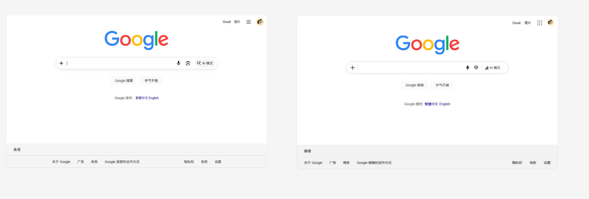

# ui-replica

[English](./README.en.md)

给一张 UI 截图或设计稿，尽量高保真地还原成可运行的前端页面。

这不是“做个差不多的页面”，而是尽量把布局、尺寸、留白、颜色、圆角、阴影和层级都对齐，同时保持实现方式可维护，不把整页粗暴裁成图片。

## 你可以拿它做什么

- 把产品截图还原成静态前端页面。
- 把设计稿拆成结构化规格，再生成更靠谱的 HTML、CSS 和 JS。
- 处理既有正常布局、又有少量复杂图标或装饰素材的页面。
- 通过截图对比反复修正，让结果越来越接近参考图。

## 先看效果

下面这个示例直接展示“参考图”和“浏览器实际打开后的还原结果”。



示例目录：[`examples/google-homepage`](./examples/google-homepage)

你可以继续点进去看：

- 参考图：[`reference.png`](./examples/google-homepage/reference.png)
- 还原结果：[`result.png`](./examples/google-homepage/result.png)
- 结构化规格稿：[`spec.md`](./examples/google-homepage/spec.md)
- 页面源码：[`index.html`](./examples/google-homepage/index.html)、[`main.js`](./examples/google-homepage/main.js)、[`styles/main.css`](./examples/google-homepage/styles/main.css)
- 截图脚本：[`scripts/capture.js`](./examples/google-homepage/scripts/capture.js)

## 它适合什么场景

适合：

- 你有一张明确的截图、视觉稿或设计图，希望页面尽量还原。
- 你不只关心“大概像”，而是关心细节是否对齐。
- 页面里有一些不适合纯手写近似的小图标、Logo 或异形边框。

不太适合：

- 你只想快速做一个风格类似的页面。
- 你的重点是业务逻辑、接口联调、状态管理，不是视觉还原。
- 输入信息太少，但又要求结果必须完全准确。

## 它怎么做

这个仓库的核心思路是先判断“该怎么还原”，再开始写页面，而不是看图直接硬写代码。

流程大致是：

1. 先读取设计图尺寸和页面主体范围。
2. 拆出页面一级结构，区分真实布局元素和纯视觉元素。
3. 判断每部分更适合用原生布局、SVG，还是小范围素材复用。
4. 先做骨架正确的首版页面。
5. 按参考图尺寸截图回拍，对照修正偏差。

这样做的好处是，既能追求高保真，也能避免把本来应该正常布局实现的内容做成一堆不可维护的位图。

## 怎么快速查看示例

以 `examples/google-homepage` 为例：

```bash
cd examples/google-homepage
npm install
npm run capture
```

执行后会生成 `preview.png`。这一步会启动本地静态服务，再用无头浏览器截图，方便继续和参考图对比。

## 如果你是来复用这套流程

这个仓库本质上是一个给 Codex 使用的 `ui-replica` skill，用来把“看图写页面”变成一条更稳定的工程流程。

完整规则在 [`SKILL.md`](./SKILL.md)，细化文档在：

- [`references/ui-replication-workflow.md`](./references/ui-replication-workflow.md)
- [`references/icon-extraction-workflow.md`](./references/icon-extraction-workflow.md)

## 仓库结构

- `examples/`：示例和可直接查看的效果
- `SKILL.md`：完整技能说明和硬规则
- `references/`：还原流程、图标提取等细化文档
- `agents/`：相关 agent 配置
